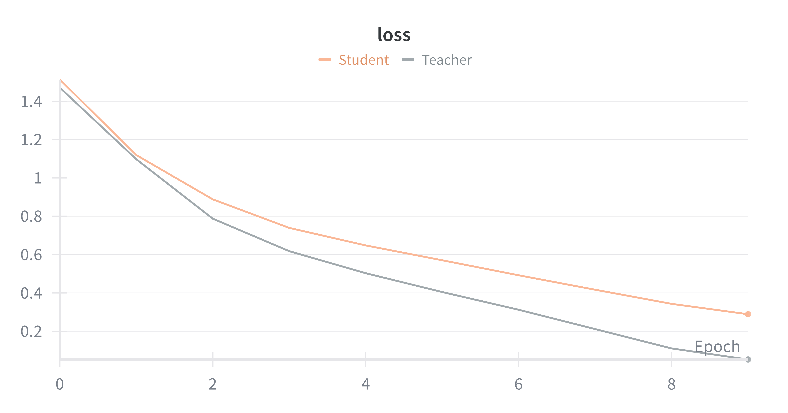
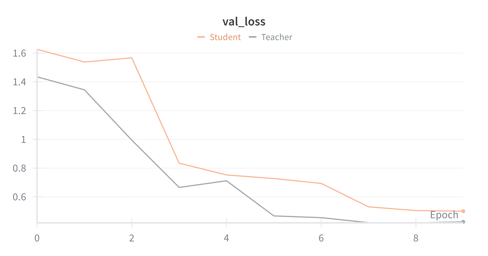
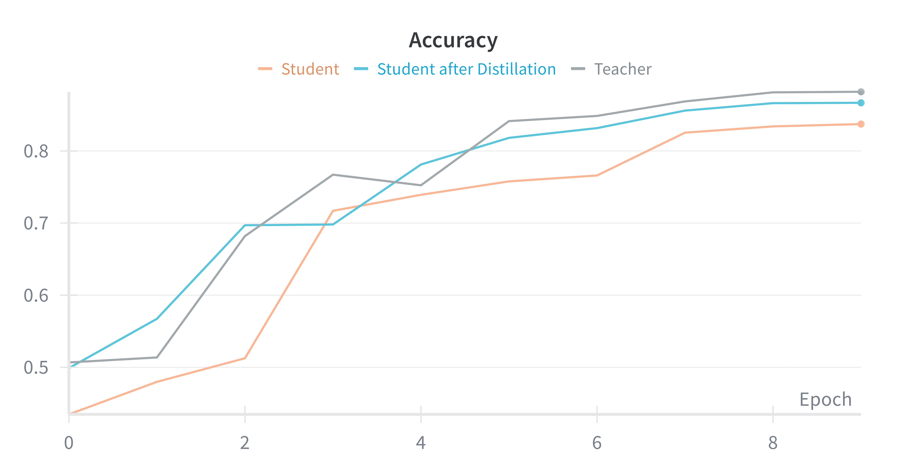

# LAB1: MLPs, Residual Networks, and Knowledge Distillation

This project explores the design, training, and evaluation of deep learning architectures specifically Multilayer Perceptrons (MLPs) and Convolutional Neural Networks (CNNs)—on image classification tasks using MNIST and CIFAR datasets. The study focuses on understanding how network depth and residual connections impact training stability and performance.

Key components of the project include:

- Building and training baseline MLPs on MNIST.
- Introducing Residual MLPs to overcome vanishing gradient issues in deeper networks.
- Comparing plain CNNs vs Residual CNNs on CIFAR-10 to analyze depth benefits in convolutional architectures.
- Exploring transfer learning and fine-tuning of pre-trained residual CNNs for CIFAR-100, including feature extraction with classical classifiers and end-to-end fine-tuning.


<details>
<summary><strong>Project Structure</strong></summary>

```
lab1/
├── configs/
│   └── config.py              # Configuration classes for all experiments
├── models/
│   ├── mlp.py                 # Multi-Layer Perceptron models
│   └── cnn.py                 # Convolutional Neural Network models
├── utils/
│   ├── data_utils.py          # Dataset loading and preprocessing
│   └── trainer.py             # Training loops and utilities
├── experiments/
│   ├── experiment_mlp.py      # Exercise 1.1 & 1.2: MLP experiments
│   ├── experiment_cnn.py      # Exercise 1.3: CNN experiments
│   └── experiment_distillation.py  # Exercise 2.2: Knowledge distillation
└── README.md                
```

</details>

## Exercises

### Exercise 1.1: MLP Depth Comparison

Compare Multi-Layer Perceptrons of different depths **without** residual connections on MNIST.

**Goal**: Verify that deeper networks don't always perform better.

### Implementation details 
| Component            | Description                                                   |
|----------------------|---------------------------------------------------------------|
| **Input**            | 28 × 28 pixel images, flattened into a 784-dimensional vector |
| **Hidden Layer**     | Fully connected layer with 512 units                          |
| **Output**           | 10 classes (digits 0–9)                                       |
| **Loss Function**    | CrossEntropyLoss                                              |
| **Optimizer**        | Adam with learning rate = 0.001                               |
| **Batch Size**       | 64                                                            |
| **Train/Val Split**  | 80% training, 20% validation                                  |
| **Epochs (default)** | 10                                                            |

By default, it trains for 10 epochs.
### Result
|      Depth      | Val Accuracy |
|:---------------:|:------------:|
|      **2**      |    98.26%    |
|      **4**      |    98.64%    |
|      **6**      |    98.37%    |
|      **8**      |    98.75%    |
|     **10**      |    98.82%    |

### How to run 
```bash
python experiments/experiment_mlp.py
```

This will train MLPs with depths [2, 4, 6, 8, 10] and compare their performance.

### Exercise 1.2: Residual Connections in MLPs

Compare MLPs **with** and **without** residual connections.

**Goal**: Verify that residual connections help train deeper networks.

### Result
| Depth  | Acc MLP | Acc MLP Residual | Improvement |
|:------:|:-------:|:----------------:|:-----------:|
| **6**  | 98.37%  |      98.60%      |   +0.23%    |
| **8**  | 98.75%  |      92.68%      |   -0.07%    |
| **10** | 98.82%  |      98.64%      |   -0.18%    |

### How to run 
```bash
python experiments/experiment_mlp.py
```

The script will automatically run both Exercise 1.1 and 1.2.

### Exercise 1.3: CNNs on CIFAR-10

Train Convolutional Neural Networks with and without residual connections on CIFAR-10.

| Component        | Description                                                                   |
|------------------|-------------------------------------------------------------------------------|
| Models           | `CNN` (plain stacked conv blocks), `ResidualCNN` (ResNet-style `BasicBlock`)  |
| Blocks Tested    | \[1, 5, 10]                                                                   |
| Channels         | \[64. 128, 256, 512]                                                          |
| Dataset          | CIFAR-10 (32×32 RGB), 80/20 train/val, test split included                    |
| Loss             | CrossEntropyLoss                                                              |
| Optimizer        | SGD (lr = 0.001)                                                              |
| Batch Size       | 128                                                                           |
| Epochs           | 20                                                                            |


### Result
| N. Blocks | Acc CNN | Acc CNN Residual | Improvement |
|:---------:|:-------:|:----------------:|:-----------:|
|   **1**   | 38.57%  |      41.55%      |   +2.98%    |
|   **5**   | 43.98%  |      58.76%      |   +14.78%   |
|  **10**   | 61.39%  |      78.05%      |   +16.66%   |


### How to run
**Compare different depths without residual:**

```bash
python experiments/experiment_cnn.py --experiment depths
```

**Compare with and without residual connections:**
```bash
python experiments/experiment_cnn.py --experiment residual
```

**Run all CNN experiments:**
```bash
python experiments/experiment_cnn.py --experiment all
```

**Train teacher model for distillation:**
```bash
python experiments/experiment_cnn.py --experiment teacher
```

### Exercise 2.2: Knowledge Distillation

Distill knowledge from a large teacher model into a smaller student model.

**Step-by-step:**
- Train a baseline student (hard labels only)
- Extract teacher outputs
- Train student with distillation (soft + hard labels)
- Compare results

| Name           | blocks |  params | Conv layers |
|:---------------|:------:|--------:|:-----------:|
| Teacher        |   4    |   11.8M |      8      |
| Student        |   3    | 700.46K |      6      |


To train the student, the following procedure was followed:
* A dataset was constructed containing the probability distributions predicted by the teacher for each training image, to improve efficiency.
* A combination of cross-entropy loss (on the hard labels) and KL divergence loss (on the soft labels from the teacher) was employed.


<div>
  
  
  
</div>


As shown in the graphs, after distillation the student is able to achieve better performance compared to its non-distilled version.


### How to run

1. **Train teacher model (large CNN):**
   ```bash
   python experiments/experiment_cnn.py --experiment teacher
   ```

2. **Run complete distillation experiment:**
   ```bash
   python experiments/experiment_distillation.py --run-all
   ```
